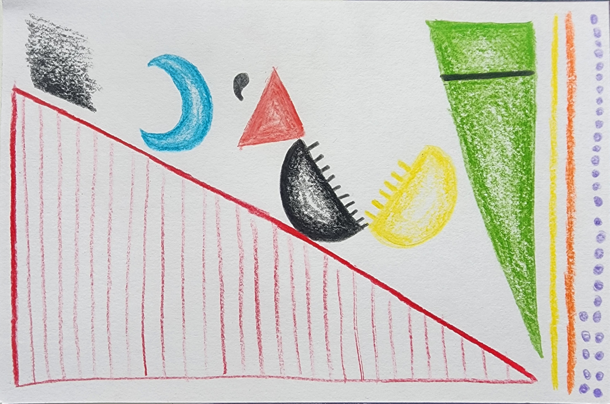

# Diego Alejandro Martinez Cruz

## Data Selfie:

## Intro Paragraph

I am a second-year MSCAPP student. I majored in Economics and I have a master's in this field too. Before Harris, I worked for 9 years at the Operations and Market Analysis Department at the Central Bank of Colombia, thus I have gained professional experience in the public sector, specifically in market analysis. In this regard, I recognize the importance of data visualization techniques that contribute to the agile transmission of ideas and concepts and to timely decision-making, being my primary motivation in this class.